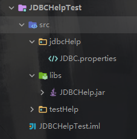
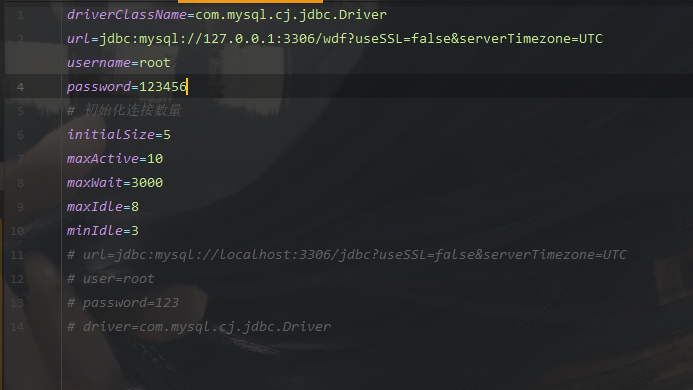
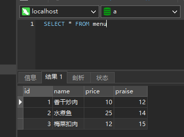

# JDBCHelp
 CACode-cctvadmin-JDBCHelp

  CACode-JDBCHelp-专注Java/Android开发

Toggle navigation  [CACode-cctvadmin : JDBCHelp](http://www.adminznh.ren)

*   [下载](../../File/JDBCHelp.jar)
*   [原生方法：​](#)
*   [read()​](#read)
*   [update()](#update)
*   [继承方法：​](#)
*   [getDs()](#ds)
*   [getConnection()](#conn)
*   [close()​](#close)
*   [查看JavaDoc](http://adminznh.ren/JDBC/JDBCHelpDoc/index.html)

特别鸣谢

* * *

本架包全权由cctvadmin编写，基于我国强大的阿里云Druid连接池

读取：

[read​(Object\[\] sql, int lineCount, String sqlPrepared)](#read)  
[read​(String sql, int lineCount)](#read)  

更新：

[update​(Object\[\] sql, String sqlPrepared)](#update)  
[update​(String sql)](#update)  

获取：

[getDs()](#ds)  
[getConnection()](#conn)  

关闭：

[close​(Connection conn)](#close)  
[close​(Connection conn, Statement stmt)](#close)  
[close​(Connection conn, Statement stmt, ResultSet rs)](#close)  

* * *

使用前须知

* * *

    使用方法:  
        在你的src目录下新建一个\[包/配置文件\] jdbcHelp/JDBC.properties  
        示例:  
        
    
        连接池包，包含

        1.获取连接池对象

        2.获取Connection连接

        3.归还连接池

        配置文件：  

    driverClassName=com.mysql.cj.jdbc.Driver

    url=jdbc:mysql://127.0.0.1:3306/数据库名?useSSL=false&serverTimezone=UTC

    username=登录账号

    password=登录密码

    # 初始化连接数量

    initialSize=5

    maxActive=10

    maxWait=3000

    maxIdle=8

    minIdle=3` 
                    示例：
                    

    

                    

    架包仅适用JDK13及以上，MySQL8及以上
                

            

* * *

准备好了吗

准备好了 还没准备  

[感谢您阅读JDBCHelp文档，祝您事业蒸蒸日上！](#)
* * *

# JDBCDataSource基类

* * *

    导入的包：

    /*
    * 版权所有(C)，CACode，2020，所有权利保留。
    *
    * 项目名： JDBCHelp
    * 文件名： JDBCDataSource.java
    * 模块说明：
    * 修改历史:
    * 2020-3-15 - CACode - 创建。
    */
    package CACode.cctvadmin.jdbcHelp.java;

    import com.alibaba.druid.pool.DruidDataSourceFactory;

    import javax.sql.DataSource;
    import java.io.InputStream;
    import java.sql.Connection;
    import java.sql.ResultSet;
    import java.sql.SQLException;
    import java.sql.Statement;
    import java.util.Properties;  

* * *

# 构造方法

* * *

    /**
    * 加载配置文件  
    * 示例：  
    *   this.getClass().getClassLoader().getResourceAsStream("jdbcHelp/JDBC.properties");
    *   
    或：  
    *   JDBCHelp.class.getClassLoader().getResourceAsStream("jdbcHelp/JDBC.properties");
    *   
    可以直接复制粘贴
    *
    * @param path 文件所在路径
    */
    public JDBCDataSource(InputStream path) {
        Properties pro = new Properties();
        try {
            pro.load(path);
            setDs(DruidDataSourceFactory.createDataSource(pro));
        } catch (Exception e) {
            e.printStackTrace();
        }
    }` 
                

## 使用：

## getDs()

    /*
    * Copyright (C), CACode, 2020, all rights reserved.
    *
    * Project name： JDBCHelpTest
    * File name： JdbcTest.java
    *  Module declaration:
    * Modify the history:
    * 2020-4-25 - CACode - Create。
    */

    package testHelp;

    import jdbc.JDBCHelp;

    import javax.sql.DataSource;

    /**
    * @author CACode http://www.adminznh.ren
    * @version 1.0
    * @date 2020/4/25 7:13
    */
    public class JdbcTest {
        public static void main(String[] args) {
            JDBCHelp jdbcHelp = new JDBCHelp(JdbcTest.class.getClassLoader().getResourceAsStream("jdbcHelp/JDBC.properties"));
            DataSource ds = jdbcHelp.getDs();
        }
    }
                        

源代码：

    /**
        * 返回连接池对象DataSource
        *
        * @return DataSource
        */
        public DataSource getDs() {
            return ds;
        }
                        

## 使用：

## getConnection()

    /*
    * Copyright (C), CACode, 2020, all rights reserved.
    *
    * Project name： JDBCHelpTest
    * File name： JdbcTest.java
    *  Module declaration:
    * Modify the history:
    * 2020-4-25 - CACode - Create。
    */

    package testHelp;

    import jdbc.JDBCHelp;

    import java.sql.Connection;
    import java.sql.SQLException;

    /**
    * @author CACode http://www.adminznh.ren
    * @version 1.0
    * @date 2020/4/25 7:13
    */
    public class JdbcTest {
        public static void main(String[] args) {
            JDBCHelp jdbcHelp = new JDBCHelp(JdbcTest.class.getClassLoader().getResourceAsStream("jdbcHelp/JDBC.properties"));
            Connection connection = null;
            try {
                connection = jdbcHelp.getConnection();
            } catch (SQLException throwables) {
                throwables.printStackTrace();
            }
        }
    } 
                    

源代码：

    /**
    * 返回连接池连接
    *
    * @return Connection对象
    * @throws SQLException 抛出SQLException异常
    */
    public Connection getConnection() throws SQLException {
        return ds.getConnection();
    }` 
                        

## 使用：

## close​(java.sql.Connection conn)  
    
    /*
    * Copyright (C), CACode, 2020, all rights reserved.
    *
    * Project name： JDBCHelpTest
    * File name： JdbcTest.java
    *  Module declaration:
    * Modify the history:
    * 2020-4-25 - CACode - Create。
    */

    package testHelp;

    import jdbc.JDBCHelp;

    import java.sql.Connection;
    import java.sql.SQLException;

    /**
    * @author CACode http://www.adminznh.ren
    * @version 1.0
    * @date 2020/4/25 7:13
    */
    public class JdbcTest {
        public static void main(String[] args) {
            JDBCHelp jdbcHelp = new JDBCHelp(JdbcTest.class.getClassLoader().getResourceAsStream("jdbcHelp/JDBC.properties"));
            Connection connection = null;
            try {
                connection = jdbcHelp.getConnection();
            } catch (SQLException throwables) {
                throwables.printStackTrace();
            } finally {
                try {
                    jdbcHelp.close(connection);
                } catch (SQLException throwables) {
                    throwables.printStackTrace();
                }
            }
        }
    }
                    

源代码：

    /**
    * 归还连接池
    *
    * @param conn Connection对象
    * @throws SQLException 抛出SQLException异常
    */
    public void close(Connection conn) throws SQLException {
        close(conn, null, null);
    }` 
                        

## 使用：

## close​(java.sql.Connection conn, java.sql.Statement stmt)  
    

    /*
    * Copyright (C), CACode, 2020, all rights reserved.
    *
    * Project name： JDBCHelpTest
    * File name： JdbcTest.java
    *  Module declaration:
    * Modify the history:
    * 2020-4-25 - CACode - Create。
    */

    package testHelp;

    import jdbc.JDBCHelp;

    import java.sql.Connection;
    import java.sql.SQLException;
    import java.sql.Statement;

    /**
    * @author CACode http://www.adminznh.ren
    * @version 1.0
    * @date 2020/4/25 7:13
    */
    public class JdbcTest {
        public static void main(String[] args) {
            JDBCHelp jdbcHelp = new JDBCHelp(JdbcTest.class.getClassLoader().getResourceAsStream("jdbcHelp/JDBC.properties"));
            Connection connection = null;
            Statement statement = null;
            try {
                connection = jdbcHelp.getConnection();
                statement = connection.createStatement();
                int drop_database_user = statement.executeUpdate("DROP DATABASE user");
            } catch (SQLException throwables) {
                throwables.printStackTrace();
            } finally {
                try {
                    jdbcHelp.close(connection, statement);
                } catch (SQLException throwables) {
                    throwables.printStackTrace();
                }
            }
        }
    } 
                    

源代码：

    /**
    * 归还连接池
    *
    * @param conn Connection对象
    * @param stmt Statement对象
    * @throws SQLException 抛出SQLException异常
    */
    public void close(Connection conn, Statement stmt) throws SQLException {
        close(conn, stmt, null);
    }
                    

## 使用：

## close​(java.sql.Connection conn, java.sql.Statement stmt, java.sql.ResultSet rs)

    /*
    * Copyright (C), CACode, 2020, all rights reserved.
    *
    * Project name： JDBCHelpTest
    * File name： JdbcTest.java
    *  Module declaration:
    * Modify the history:
    * 2020-4-25 - CACode - Create。
    */

    package testHelp;

    import jdbc.JDBCHelp;

    import java.sql.Connection;
    import java.sql.ResultSet;
    import java.sql.SQLException;
    import java.sql.Statement;

    /**
    * @author CACode http://www.adminznh.ren
    * @version 1.0
    * @date 2020/4/25 7:13
    */
    public class JdbcTest {
        public static void main(String[] args) {
            JDBCHelp jdbcHelp = new JDBCHelp(JdbcTest.class.getClassLoader().getResourceAsStream("jdbcHelp/JDBC.properties"));
            Connection connection = null;
            Statement statement = null;
            ResultSet resultSet = null;
            try {
                connection = jdbcHelp.getConnection();
                statement = connection.createStatement();
                resultSet = statement.executeQuery("SELECT * FROM menu");
                while (resultSet.next())
                    System.out.println(resultSet.getObject(1));
            } catch (SQLException throwables) {
                throwables.printStackTrace();
            } finally {
                try {
                    jdbcHelp.close(connection, statement, resultSet);
                } catch (SQLException throwables) {
                    throwables.printStackTrace();
                }
            }
        }
    }
                    

源代码：

    /**
    * 归还连接池
    *
    * @param conn Connection对象
    * @param stmt Statement对象
    * @param rs   ResultSet对象
    * @throws SQLException 抛出SQLException异常
    */
    public void close(Connection conn, Statement stmt, ResultSet rs) throws SQLException {
        if (rs != null) {
            try {
                rs.close();
            } catch (SQLException e) {
                e.printStackTrace();
            }
        }
        if (stmt != null) {
            try {
                stmt.close();
            } catch (SQLException e) {
                e.printStackTrace();
            }
        }
        if (conn != null) {
            try {
                conn.close();
            } catch (SQLException e) {
                e.printStackTrace();
            }
        }
    }
                    

* * *

# JDBCHelp类

* * *

导入的包：

    /*
    * 版权所有(C)，CACode，2020，所有权利保留。
    *
    * 项目名： JDBCHelp
    * 文件名： JDBCHelp.java
    * 模块说明：
    * 修改历史:
    * 2020-3-12 - CACode - 创建。
    */
    package CACode.cctvadmin.jdbcHelp.java;

    import java.io.InputStream;
    import java.sql.*;
    import java.util.List;
    import java.util.Vector;
                

## 构造方法

    /**
    * 加载配置文件  
    * 示例：  
    *   this.getClass().getClassLoader().getResourceAsStream("jdbcHelp/JDBC.properties");
    * 或：  
    *   JDBCHelp.class.getClassLoader().getResourceAsStream("jdbcHelp/JDBC.properties");
    * 可以直接复制粘贴  
    *
    * @param path 文件所在路径
    */
    public JDBCHelp(InputStream path) {
        super(path);
    }
                

## 在使用之前，你必须了解一下read()方法的原理

  

List<List<Object>>效果：

<table>
    <tr class="active">
        <th>list.get(0)&#8595; </th>
        <th>list.get(1)&#8595; </th>
        <th>list.get(2)&#8595; </th>
        <th>list.get(3)&#8595; </th>
        <th>list.get(4)&#8595; </th>
    </tr>
    <tr class="success">
        <td>list.get(0).get(0)</td>
        <td>list.get(1).get(0)</td>
        <td>list.get(2).get(0)</td>
        <td>list.get(3).get(0)</td>
        <td>list.get(4).get(0)</td>
    </tr>
    <tr class="warning">
        <td>list.get(0).get(1)</td>
        <td>list.get(1).get(1)</td>
        <td>list.get(2).get(1)</td>
        <td>list.get(3).get(1)</td>
        <td>list.get(4).get(1)</td>
    </tr>
    <tr class="danger">
        <td>list.get(0).get(2)</td>
        <td>list.get(1).get(2)</td>
        <td>list.get(2).get(2)</td>
        <td>list.get(3).get(2)</td>
        <td>list.get(4).get(2)</td>
    </tr>
    <tr class="info">
        <td>list.get(0).get(3)</td>
        <td>list.get(1).get(3)</td>
        <td>list.get(2).get(3)</td>
        <td>list.get(3).get(3)</td>
        <td>list.get(4).get(3)</td>
    </tr>
    <tr class="success">
        <td>list.get(0).get(4)</td>
        <td>list.get(1).get(4)</td>
        <td>list.get(2).get(4)</td>
        <td>list.get(3).get(4)</td>
        <td>list.get(4).get(4)</td>
    </tr>
    <tr class="warning">
        <td>list.get(0).get(5)</td>
        <td>list.get(1).get(5)</td>
        <td>list.get(2).get(5)</td>
        <td>list.get(3).get(5)</td>
        <td>list.get(4).get(5)</td>
    </tr>
    <tr class="danger">
        <td>list.get(0).get(6)</td>
        <td>list.get(1).get(6)</td>
        <td>list.get(2).get(6)</td>
        <td>list.get(3).get(6)</td>
        <td>list.get(4).get(6)</td>
    </tr>
</table>

对应关系

<table>
    <tr>
        <td>&#8595;&#8595;&#8595;&#8595;&#8595;&#8595;&#8595;</td>
    </tr>
    <tr>
        <td>&#8595;&#8595;&#8595;&#8595;&#8595;&#8595;&#8595;</td>
    </tr>
    <tr>
        <td>&#8595;&#8595;&#8595;&#8595;&#8595;&#8595;&#8595;</td>
    </tr>
    <tr>
        <td>&#8595;&#8595;&#8595;&#8595;&#8595;&#8595;&#8595;</td>
    </tr>
    <tr>
        <td>&#8595;&#8595;&#8595;&#8595;&#8595;&#8595;&#8595;</td>
    </tr>
    <tr>
        <td>&#8595;&#8595;&#8595;&#8595;&#8595;&#8595;&#8595;</td>
    </tr>
    <tr>
        <td>&#8595;&#8595;&#8595;&#8595;&#8595;&#8595;&#8595;</td>
    </tr>
    <tr>
        <td>&#8595;&#8595;&#8595;&#8595;&#8595;&#8595;&#8595;</td>
    </tr>
</table>

数据库表效果：

<table class="table table-condensed table-bordered table-hover">
    <tr class="active">
        <th>row1&#8595;</th>
        <th>row2&#8595;</th>
        <th>row3&#8595;</th>
        <th>row4&#8595;</th>
        <td>row5&#8595;</td>
    </tr>
    <tr class="success">
        <td>1</td>
        <td>2</td>
        <td>3</td>
        <td>4</td>
        <td>5</td>
    </tr>
    <tr class="warning">
        <td>1</td>
        <td>2</td>
        <td>3</td>
        <td>4</td>
        <td>5</td>
    </tr>
    <tr class="danger">
        <td>1</td>
        <td>2</td>
        <td>3</td>
        <td>4</td>
        <td>5</td>
    </tr>
    <tr class="info">
        <td>1</td>
        <td>2</td>
        <td>3</td>
        <td>4</td>
        <td>5</td>
    </tr>
    <tr class="success">
        <td>1</td>
        <td>2</td>
        <td>3</td>
        <td>4</td>
        <td>5</td>
    </tr>
    <tr class="warning">
        <td>1</td>
        <td>2</td>
        <td>3</td>
        <td>4</td>
        <td>5</td>
    </tr>
    <tr class="danger">
        <td>1</td>
        <td>2</td>
        <td>3</td>
        <td>4</td>
        <td>5</td>
    </tr>
</table>

实现原理:

使用SELECT查询返回的数据形成一张如下的数据表：

我们使用以下代码：

    List<List<Object>> list = new Vector<>();
    for (int i = 0; i < lineCount; i++)
        list.add(new java.util.Vector<>());
                    

来创建对应列,如果lineCount==4时，那么List<List<Object>> list 与数据表的关系就是：

<table class="table table-condensed table-bordered table-hover">
    <tr>
        <th>list.get(0)</th>
        <th>list.get(1)</th>
        <th>list.get(2)</th>
        <th>list.get(3)</th>
    </tr>
    <tr>
        <td>1 --&gt;list.get(0).get(0)</td>
        <td>香干炒肉 --&gt;list.get(1).get(0)</td>
        <td>10 --&gt;list.get(2).get(0)</td>
        <td>12 --&gt;list.get(3).get(0)</td>
    </tr>
    <tr>
        <td>2 --&gt;list.get(0).get(1)</td>
        <td>水煮鱼 --&gt;list.get(1).get(1)</td>
        <td>25 --&gt;list.get(2).get(1)</td>
        <td>14 --&gt;list.get(3).get(1)</td>
    </tr>
    <tr>
        <td>3 --&gt;list.get(0).get(2)</td>
        <td>梅菜扣肉 --&gt;list.get(1).get(2)</td>
        <td>12 --&gt;list.get(2).get(2)</td>
        <td>15 --&gt;list.get(3).get(2)</td>
    </tr>
</table>

## 使用：

## read​(String sql, int lineCount)

    /*
    * Copyright (C), CACode, 2020, all rights reserved.
    *
    * Project name： JDBCHelpTest
    * File name： JdbcTest.java
    *  Module declaration:
    * Modify the history:
    * 2020-4-25 - CACode - Create。
    */

    package testHelp;

    import CACode.cctvadmin.jdbcHelp.java.JDBCHelp;

    import java.sql.SQLException;
    import java.util.List;

    /**
    * @author CACode http://www.adminznh.ren
    * @version 1.0
    * @date 2020/4/25 7:13
    */
    public class JdbcTest {
        public static void main(String[] args) {
            JDBCHelp jdbcHelp = new JDBCHelp(JdbcTest.class.getClassLoader().getResourceAsStream("jdbcHelp/JDBC.properties"));
            try {
                int lineCount = 2;
                List> read = jdbcHelp.read("SELECT Id,NickName FROM user", lineCount);
                for (int i = 0; i < read.get(0).size(); i++) {
                    for (int j = 0; j < lineCount; j++) {
                        System.out.println(read.get(j).get(i));
                    }
                }
            } catch (SQLException throwables) {
                throwables.printStackTrace();
            }
        }
    }
                    

源代码：

    /**
    * 返回读取到数据表的所有数据的集合
    * 注意：
    * lineCount的值代表要读取的列数
    * lineCount的值有多少就会返回多少个范型是List的List集合, 每一个对象代表一列的所有值,
    * 如：
    * list_1 list_2 list_3
    *     1     2     3
    *     1     2     3
    *     1     2     3
    *
    * @param sql       sql语句
    * @param lineCount 读取的列的数量
    * @return 返回java.util.List对象
    * @throws SQLException 抛出sql异常
    *                      1.sql语句错误
    *                      2.行数错误
    */
    public List> read(String sql, int lineCount) throws SQLException {
        List> list = new Vector<>();
        for (int i = 0; i < lineCount; i++)
            list.add(new java.util.Vector<>());
        Connection conn = null;
        Statement stmt = null;
        ResultSet rs = null;
        try {
            conn = getConnection();
            stmt = conn.createStatement();
            rs = stmt.executeQuery(sql);
            while (rs.next()) {
                for (int i = 0; i < lineCount; i++) {
                    list.get(i).add(rs.getObject((i + 1)));
                }
            }
        } catch (SQLException e) {
            e.printStackTrace();
        } finally {
            close(conn, stmt, rs);
        }
        return list;
    }
                    

使用：

read​(Object\[\] sql, int lineCount, String sqlPrepared)  

    /*
    * Copyright (C), CACode, 2020, all rights reserved.
    *
    * Project name： JDBCHelpTest
    * File name： JdbcTest.java
    *  Module declaration:
    * Modify the history:
    * 2020-4-25 - CACode - Create。
    */

    package testHelp;

    import CACode.cctvadmin.jdbcHelp.java.JDBCHelp;

    import java.sql.SQLException;
    import java.util.List;

    /**
    * @author CACode http://www.adminznh.ren
    * @version 1.0
    * @date 2020/4/25 7:13
    */
    public class JdbcTest {
        public static void main(String[] args) {
            JDBCHelp jdbcHelp = new JDBCHelp(JdbcTest.class.getClassLoader().getResourceAsStream("jdbcHelp/JDBC.properties"));
            try {
                int lineCount = 2;
                List> read = jdbcHelp.read(
                        new Object[]{"Id", "NickName", "user"},
                        lineCount,
                        "SELECT ?,? FROM ?");
                for (int i = 0; i < read.get(0).size(); i++) {
                    for (int j = 0; j < lineCount; j++) {
                        System.out.println(read.get(j).get(i));
                    }
                }
            } catch (SQLException throwables) {
                throwables.printStackTrace();
            }
        }
    }
                    

源代码：

    /**
    * 防止SQL注入的返回读取到数据表的所有数据的集合
    * 用法：
    * Object[] obj = new Object[]{"张三",1,"李四"};
    * int lineCount = 3;
    *     String SqlPrepared = "SELECT COUNT(*) FROM test WHERE
    * line1=? AND line2=? AND line3=?";
    *     JDBCHelp.read(obj,lineCount,SqlPrepared);
    * 注意：
    * lineCount的值代表要读取的列数
    * lineCount的值有多少就会返回多少个范型是List的List集合, 每一个对象代表一列的所有值,
    * 如：
    * list_1 list_2 list_3
    *     1     2     3
    *     1     2     3
    *     1     2     3
    *      问号数量必须与数组长度一致，否则抛出 SQLException
    *
    * @param sql         需要传入的值
    * @param lineCount   查询的数据行数
    * @param sqlPrepared sql的格式
    * @return 防止sql注入的同时执行query方法
    * @throws SQLException 抛出sql异常
    */
    public List> read(Object[] sql, int lineCount, String sqlPrepared) throws SQLException {
        List> list = new Vector<>();
        for (int i = 0; i < lineCount; i++)
            list.add(new java.util.Vector<>());
        Connection conn = null;
        PreparedStatement pstmt = null;
        ResultSet rs = null;
        try {
            conn = getConnection();
            pstmt = conn.prepareStatement(sqlPrepared);
            for (int i = 0; i < sql.length; i++) {
                pstmt.setObject((i + 1), sql[i]);
            }
            rs = pstmt.executeQuery();
            while (rs.next()) {
                for (int i = 0; i < lineCount; i++) {
                    list.get(i).add(rs.getObject((i + 1)));
                }
            }
        } catch (SQLException e) {
            e.printStackTrace();
        } finally {
            close(conn, pstmt, rs);
        }
        return list;
    }
                    

## 使用：

## update​(String sql)

    /*
    * Copyright (C), CACode, 2020, all rights reserved.
    *
    * Project name： JDBCHelpTest
    * File name： JdbcTest.java
    *  Module declaration:
    * Modify the history:
    * 2020-4-25 - CACode - Create。
    */

    package testHelp;

    import CACode.cctvadmin.jdbcHelp.java.JDBCHelp;

    import java.sql.SQLException;

    /**
    * @author CACode http://www.adminznh.ren
    * @version 1.0
    * @date 2020/4/25 7:13
    */
    public class JdbcTest {
        public static void main(String[] args) {
            JDBCHelp jdbcHelp = new JDBCHelp(JdbcTest.class.getClassLoader().getResourceAsStream("jdbcHelp/JDBC.properties"));
            int update = 0;
            try {
                update = jdbcHelp.update("UPDATE user SET NickName='CACode' WHERE Id=1000000");
                if (update > 0) {
                    System.out.println("更改成功");
                } else {
                    System.out.println("更改失败");
                }
            } catch (SQLException throwables) {
                throwables.printStackTrace();
            }

        }
    }
                    

源代码：

    /**
    * 执行update语句返回受影响行数
    *
    * @param sql sql语句
    * @return 受影响函数
    * @throws SQLException 抛出sql异常
    */
    public int update(String sql) throws SQLException {
        Connection conn = null;
        Statement statement = null;
        try {
            conn = getConnection();
            statement = conn.createStatement();
            int i = statement.executeUpdate(sql);
            return i;
        } catch (SQLException e) {
            e.printStackTrace();
        } finally {
            close(conn, statement);
        }
        return 0;
    }

## 使用：

## update​(Object\[\] sql, String sqlPrepared)

    /*
    * Copyright (C), CACode, 2020, all rights reserved.
    *
    * Project name： JDBCHelpTest
    * File name： JdbcTest.java
    *  Module declaration:
    * Modify the history:
    * 2020-4-25 - CACode - Create。
    */

    package testHelp;

    import CACode.cctvadmin.jdbcHelp.java.JDBCHelp;

    import java.sql.SQLException;

    /**
    * @author CACode http://www.adminznh.ren
    * @version 1.0
    * @date 2020/4/25 7:13
    */
    public class JdbcTest {
        public static void main(String[] args) {
            JDBCHelp jdbcHelp = new JDBCHelp(JdbcTest.class.getClassLoader().getResourceAsStream("jdbcHelp/JDBC.properties"));
            int update = 0;
            try {
                update = jdbcHelp.update(
                        new Object[]{"user", "NickName", "CACode", "Id", "1000000"},
                        "UPDATE ? SET ?=? WHERE ?=?");
                if (update > 0) {
                    System.out.println("更改成功");
                } else {
                    System.out.println("更改失败");
                }
            } catch (SQLException throwables) {
                throwables.printStackTrace();
            }

        }
    }
                    

源代码：

    /**
    * 防止SQL注入的返回受影响行数的方法
    * 用法：
    *     Object[] obj = new Object[]{"张三",1,"李四"};
    *     String SqlPrepared = "INSERT INTO sqlTable
    * VALUES{?,?,?}";
    *     JDBCHelp.update(obj,SqlPrepared);
    * **注意：**
    *      问号数量必须与数组长度一致，否则抛出 SQLException
    *
    * @param sql[]       需要查询的条件
    * @param sqlPrepared sql的格式
    * @return 防止sql注入的同时执行update方法
    * @throws SQLException 抛出sql异常
    */
    public int update(Object[] sql, String sqlPrepared) throws SQLException {
        int count = 0;
        Connection conn = null;
        PreparedStatement pstmt = null;
        try {
            conn = getConnection();
            pstmt = conn.prepareStatement(sqlPrepared);
            for (int i = 0; i < sql.length; i++) {
                pstmt.setObject((i + 1), sql[i]);
            }
            count = pstmt.executeUpdate();
        } catch (SQLException e) {
            e.printStackTrace();
        } finally {
            close(conn, pstmt);
        }
        return count;
    }
                    

Thank you for reading(感谢您的阅读)
=============================

Do you want to download it on now?(你想现在下载吗？)
============================================

[Yes(是的)](JDBCHelp_jar/JDBCHelp.jar) No, thanks(不了，谢谢)

### ©Copyright2019-2025 CACode 粤ICP备案号：20009502号-1